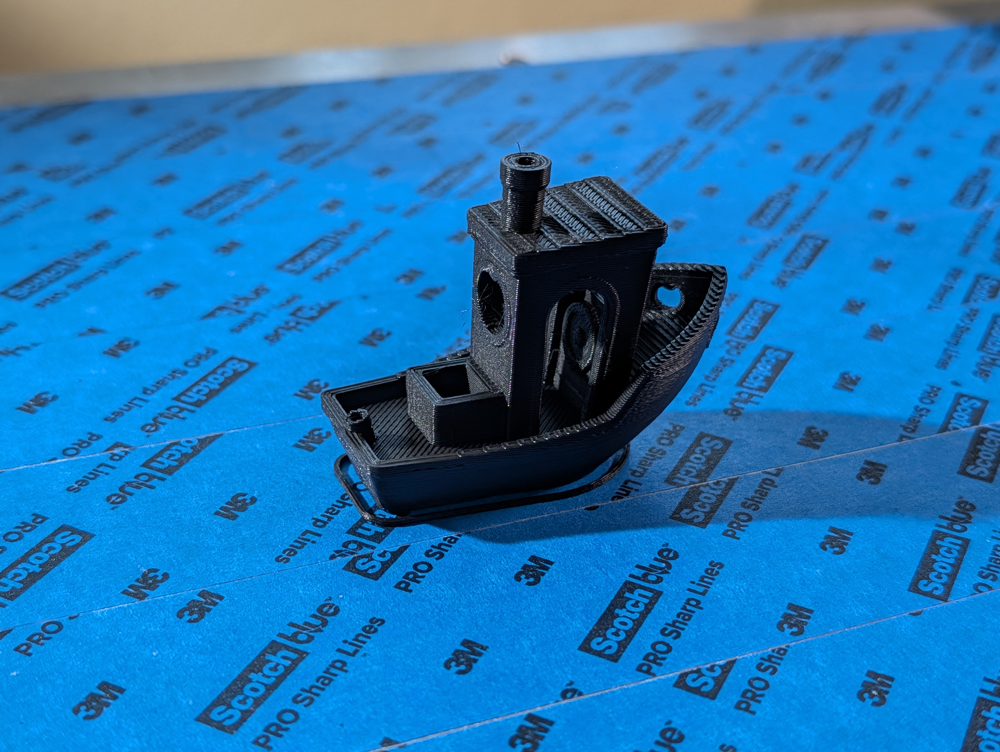
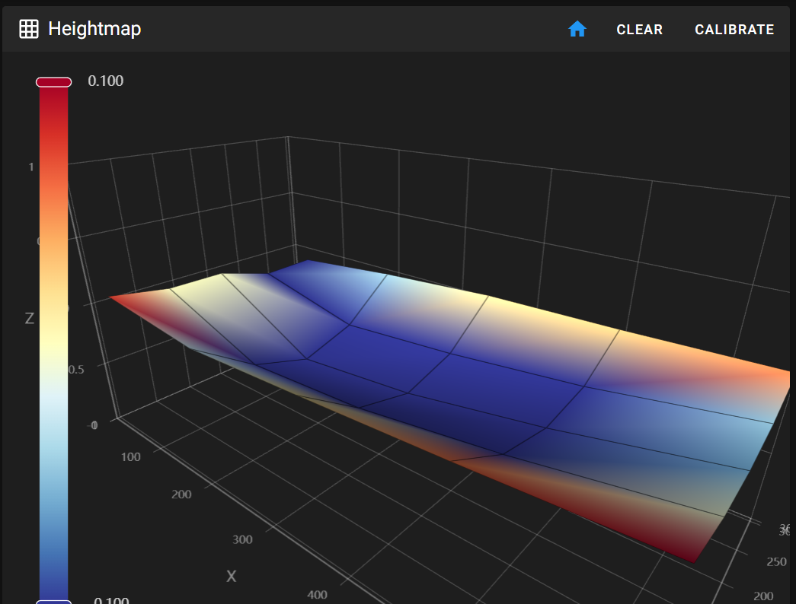

# ftxprusa

A fusion of the Folger Tech FT-6 and Prusa MK3S+

 * FT-6 Frame
 * FT-6 Kinematics/linear rails
 * FT-6 Heatbed
 * FT-6 Bed Thermistor
 * FT-6 Power supply
 * MK3S+ Extruder module
 * MK3S+ Einsy Rambo mainboard controller
 * MK3S+ Stepper motors
 * MK3S+ Screen display
 * Raspberry Pi Zero 2 W running MainsailOS

## Why

I want to turn garbage into something useful again. Folger Tech is a discontinued brand of 3d printers and is obsolete today. There are a bunch of leftover Prusa MK3S+ parts from upgraded MK4s. Why not put these both together and create something amazing?

|  | 
|:--:| 
| Pressure advance test |

|  | 
|:--:| 
| Finished Benchy on ftxprusa |

|  | 
|:--:| 
| Benchy in progress |

|  | 
|:--:| 
| Prusa MK3S+ display on FT-6 frame with swapped electronics |

## How to Build

The build process below is more of a rough outline and is very unpolished. Please proceed with caution and plan accordingly before doing anything!

Note: I unfortunately do not have the cad for the mount between the y-axis linear sled and mk3s+ extruder module.

1. Scrap all of the FT-6's electronics and leave behind anything mechanical. This includes removing its original control boards, stepper motors, wires, and more. (don't remove the pcb contacting the y-axis stepper, just the stepper itself) NOTE: Keep the FT-6's heatbed and heatbed electronics, including the ac converter to it.
2. Take apart two MK3S+ z-axis stepper motors and swap the leadscrews with the FT-6's leadscrews. CAUTION: This is a super invasive process and requires epoxy. Make sure to keep any bite marks on the FT-6 leadscrews in the stepper motor. If you have more plain Prusa stepper motors, I suggest using those instead with shaft couplers. 
3. Install the MK3S+ extruder onto the rail sled
4. Drill a 30mm diameter hole into the aluminum composite sheet that holds the two x-axis motors. This will allow routing more wires through to the control box.
5. Install the Einsy Rambo into the electronics box, as well as a switch between the ac plug to power supply to allow turning off the printer
6. Install the MK3S+ Screen display
7. Connect all neccesary cables, with any extension or custom crimped cables if needed (you definitely do need them)
8. Install MainsailOS onto your RPI Zero 2 W and install the config files provided in this repository, as well as config files for your slicer
9. Add masking/painters tape to the aluminum bed to allow better first layer adhesion
10. Done! You now have a giant printer that works half way and needs some more tinkering before its perfect

## Calibration

Start with these things roughly in order to calibrate. The config in this repository is set to my values which may not work universally

1. Calibrate your bed flatness (z-offset, bed screws, etc.)
2. PID tune your bed and nozzle heater
3. Make sure you have the right [idler screw tension](https://help.prusa3d.com/article/idler-screw-tension_177367)
4. Calculate your right "steps per mm" for your extruder [here](https://ellis3dp.com/Print-Tuning-Guide/articles/extruder_calibration.html)
5. Calculate your [pressure advance value](https://ellis3dp.com/Print-Tuning-Guide/articles/index_pressure_advance.html) (i included the gcode i've generated in /gcode)

|  | 
|:--:| 
| Calibrated bed mesh with PINDA and bed heated to 60C |

## Problems Encountered

The factory bed of the ft-6 is incredibly bent and warped. The bed mesh heightmap calibration allows the z-axis to dynamically adjust itself to how warped it is.

The x-axis linear rails had to be shifted a bit to the left to allow more usage of the bed and extend its width

Tilt on the x-axis is super common due to both leadscrews of the z axis not synced together with a belt, in addition to the bed being heavy and automatically lowering due to gravity and no power

The z-axis is a little wonky and not consistent in its z movement, causing z-calibration to be really hard (the bed is susceptible to vibration due to too high of velocity/accel. on the z-axis)

## Results

In the end, I was able to make a solid quality 3d printer after ~5 days of tuning. (not including modding/build time, possibly a month max or so) 
There are still some strange power problems and z-axis calibration still being annoying, but everything else is flawless while printing. 

I would 100% daily drive this printer.

## Sources

 * https://github.com/charminULTRA/Klipper-Input-Shaping-MK3S-Upgrade
 * The above was a huge help in configuring the mk3s parts for its firmware
 * https://www.printables.com/model/155387-0017-remix-x2-delta-p-duct-v2r22-for-the-mk3s-new
 * I upgraded to this better overhang fan duct, It may not be neccesary but I recommend it. Note: The config files does not account for the extra space that is leftover and unused

## Huge Thanks to

 * MainsailOS and klipper for existing (marlin took very long to reflash/compile changes)
 * My robotics instructor for donating this printer to further tinker around
 * The 3d printing community for the vast amount of resources and documentation to make this possible

